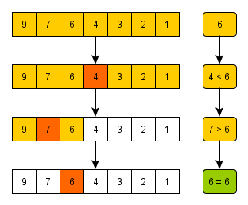

# 이진 탐색

## 이진 탐색이란?



이진 탐색이란 데이터가 **정렬돼 있는 배열**에서 특정한 값을 찾아내는 알고리즘이다.

배열의 중간에 있는 임의의 값을 선택하여 찾고자 하는 값 X와 비교한다. X가 중간 값보다 작으면 중간 값을 기준으로 좌측의 데이터들을 대상으로, X가 중간값보다 크면 배열의 우측을 대상으로 다시 탐색한다. 동일한 방법으로 다시 중간의 값을 임의로 선택하고 비교한다. 해당 값을 찾을 때까지 이 과정을 반복한다.

**이진탐색(O(logN))은 단순한 배열 순회(O(N))보다 시간복잡도에서 크게 이점을 갖는다.**

## 구현

```js
const binarySearch = function (arr, target) {
  // TODO : 여기에 코드를 작성합니다.
  let start = 0;
  let end = arr.length - 1;
  let mid;

  while (start <= end) {
    //점점 좁혀지다가 start와 end의 순서가 어긋나게 되면 반복을 종료한다

    mid = parseInt((start + end) / 2);

    if (target === arr[mid]) {
      return mid;
    } else {
      if (target < arr[mid]) {
        end = mid - 1;
      } else {
        start = mid + 1;
      }
    }
  }
  return -1;
};
```

## 참고자료

https://www.youtube.com/watch?v=zD25pqyN-OU

https://velog.io/@devjade/%EC%9D%B4%EC%A7%84%ED%83%90%EC%83%89-binary-search
