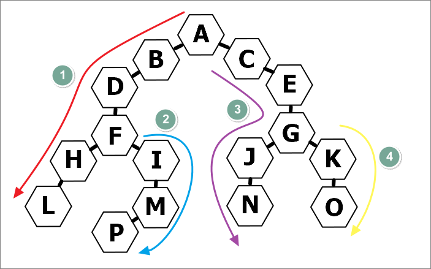
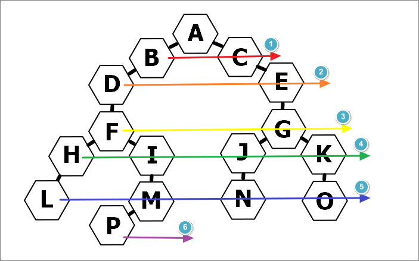

# DFS / BFS

DFS와 BFS 모두 그래프를 탐색하는 알고리즘으로, 두 방법 모두 브루트 포스를 사용한다.

## Dfs

- ### DFS란?

  - 루트 노드에서 시작해서 한 분기를 **모두 방문**하고 다음 분기로 넘어가는 방식이다.

  - 인접 노드를 깊이 우선으로 탐색하기 때문에 **깊이 우선 탐색, DFS 라고 불린다.**

  - Stack또는 재귀를 사용해서 구현한다.

  - 검색 속도는 BFS에 비해 느리지만 조금 더 간단하다.

  - 전위, 중위, 후위 순회로 나뉜다.

    

- ### 전위순회 구현(Stack)

  ```js
  const graph = {
    A: ["B", "C"],
    B: ["A", "D"],
    C: ["A", "E"],
    D: ["B", "F"],
    E: ["C", "G"],
    F: ["D", "H", "I"],
    G: ["E", "J", "K"],
    H: ["F", "L"],
    I: ["F", "M"],
    J: ["G", "N"],
    K: ["G", "O"],
    L: ["H"],
    M: ["I", "P"],
    N: ["J"],
    O: ["K"],
    P: ["M"],
  };
  const bfs = (graph, start) => {
    const checked = []; // 탐색 완료 데이터
    const willCheck = []; // 탐색 예정 데이터

    willCheck.push(start);

    while (willCheck.length !== 0) {
      const node = willCheck.pop(); // 스택(Last In First Out)
      if (!checked.includes(node)) {
        checked.push(node);
        //reverse() 제거 시 부모 -> 오른쪽 자식 -> 왼쪽 자식 순으로 순회
        willCheck.push(...graph[node].reverse());
      }
    }
    return checked;
  };
  console.log(bfs(graph, "A"));
  // ['A', 'B', 'D', 'F', 'H', 'L', 'I', 'M', 'P', 'C', 'E', 'G', 'J', 'N', 'K', 'O']
  ```

## Bfs

- ### BFS란?

  - 루트 노드에서 시작해서 **인접한 노드**들을 먼저 모두 탐색 하는 방식이다.

  - 인접 노드를 너비를 우선으로 탐색하기 때문에 **너비 우선 탐색, BFS라고 불린다.**

  - queue를 사용해서 구현한다.

  - 검색 속도가 DFS보다 빠르며 최단 거리를 구하는 문제에서 사용된다.

    

- ### 구현

  ```js
  const graph = {
    A: ["B", "C"],
    B: ["A", "D"],
    C: ["A", "E"],
    D: ["B", "F"],
    E: ["C", "G"],
    F: ["D", "H", "I"],
    G: ["E", "J", "K"],
    H: ["F", "L"],
    I: ["F", "M"],
    J: ["G", "N"],
    K: ["G", "O"],
    L: ["H"],
    M: ["I", "P"],
    N: ["J"],
    O: ["K"],
    P: ["M"],
  };
  const bfs = (graph, start) => {
    const checked = [];
    const willCheck = [];

    willCheck.push(start);

    while (willCheck.length !== 0) {
      const node = willCheck.shift(); // 큐(First In First Out)
      if (!checked.includes(node)) {
        checked.push(node);
        willCheck.push(...graph[node]);
      }
    }
    return checked;
  };
  console.log(bfs(graph, "A"));
  // ['A', 'B', 'C', 'D', 'E', 'F', 'G', 'H', 'I', 'J', 'K', 'L', 'M', 'N', 'O', 'P']
  ```

## 참고자료

https://choonse.com/2022/02/16/945/

https://think0wise.tistory.com/92

https://velog.io/@sangbin2/%ED%8A%B8%EB%A6%AC-%EC%88%9C%ED%9A%8C-BFS-DFS
