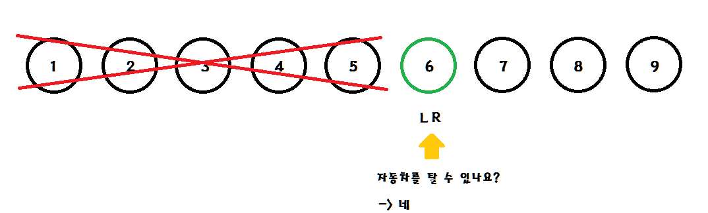

# Parametric Search

## Parametric Search란?

이분 탐색과 매우 유사한 알고리즘이다.

하지만 파라매트릭 서치는 **최적화 문제를 결정 문제로 바꾸어 푸는 것이다.**

예시를 통해 이해해 보자.

## 예시

자동차를 탈 수 있는 사람중 나이가 가장 어린 사람을 찾고자 한다.

이때 자동차를 탈 수 있는 사람이라 함은 나이가 19세 이상이라고 가정한다.
(즉, 19세 이상은 모두 탈 수 있다고 한다.)

가장 어린 사람의 번호는 몇번인가?

전제는 사람들이 나이순으로 나열 되어있다는 점이다.

이 문제를 결정 문제로 바꾸어 보자.

**자동차를 탈 수 있나요?**

이제 결정 문제로 바뀌었고, 이분 탐색과 유사하게 Left와 Right를 두어 문제를 풀어보자.

5번 이하의 사람들은 정답 범위에서 벗어난다.

 

7~9번은 모두 정답이 될 수 있고, 6번은 판단 불가하므로 6번을 판단해야한다.

따라서 Left와 Right를 조절해야 한다.

 

Left와 Right 모두 6을 가리키고, 만약 6번이 자동차를 탈 수 있으면 답은 6이된다.

 

하지만 6이 자동차를 탈 수 없다면, 정답은 7이 된다.

## 정리

- 파라매트릭 서치는 이분 탐색의 차이는 결정 문제인지 아닌지의 차이다.

- 파라매트릭 서치로 인해 정답 후보가 나타나면 연속적으로 정답후보가 나타난다.

- 시간복잡도는 O(logn)이다.

## 참고자료

https://www.crocus.co.kr/1000
